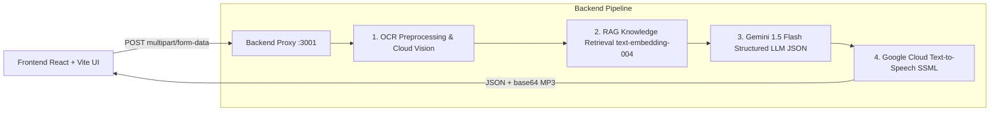

# Hmm — Understand Any Document, Instantly

Built by **Linges.D.Waran** (<lingeswarandhanapal7@gmail.com>).

> Transform intimidating government notices, convoluted rental agreements, ambiguous medical reports, and handwritten prescriptions into plain-language summaries and verified action checklists in regional Indian languages, complete with natural spoken audio.

---

## 🏛️ System Architecture



### Security & Proxy Architecture
- **Zero Frontend Leakage**: All calls to Gemini, Cloud Vision, and Cloud Text-to-Speech occur on the Node/Express backend proxy.
- **Strict Key Protection**: `.env` is excluded in `.gitignore` across both root and backend directories. Placeholder templates are provided via `.env.example`.

---

## ⚡ Tier 1 & Tier 2 Capabilities Implemented

### 1. Optical Character Recognition (OCR) (`backend/services/ocrService.js`)
- **EXIF Auto-Rotation**: Corrects sideways or rotated smartphone uploads automatically using `sharp`.
- **Dynamic Contrast Normalization**: Enhances faint or poorly lit scans before submission to Google Cloud Vision.
- **Language Hint Threading**: Passes regional language hints (`ta`, `hi`, `te`, `kn`, `bn`, `mr`, `ml`, `en`) so mixed English and Indic scripts are captured with high fidelity.
- **Empathetic Confidence Handling**: Rejects unreadable or blurry photos with friendly guidance rather than failing silently.

### 2. Retrieval-Augmented Generation (RAG) (`backend/services/ragService.js`)
- **Curated Knowledge Base (`backend/knowledge-base/`)**: 13 reference documents covering:
  - Income Tax Section 143(1), 139(9), and 148 notices
  - Model Tenancy Act eviction and security deposit rules
  - Consumer Protection Act 2019 defective goods & RBI unauthorized transaction rules
  - Plain-language medical lab report glossaries (CBC, Lipid, HbA1c, KFT, LFT)
  - Prescription safety principles and clinical abbreviations (OD, BD, TDS, AC, PC)
  - Government schemes (PM-Kisan, Ayushman Bharat PM-JAY) and municipal property tax procedures
- **Semantic Vector Store (`backend/data/embeddings.json`)**: Pre-indexed chunks embedded with Gemini's `text-embedding-004` (768 dimensions).
- **Hybrid Retrieval**: Blends cosine similarity with exact keyword matching to ground every Gemini response in verified legal sections and clinical guidelines.

### 3. Gemini LLM Structured Simplification (`backend/services/llmService.js`)
- **Schema-Enforced JSON Mode**:
  ```json
  {
    "documentType": "government_notice | medical_report | prescription | other",
    "summary": "plain-language explanation in target language",
    "keyFacts": [{ "label": "Amount to Pay", "value": "₹12,430" }],
    "nextSteps": ["step one", "step two"],
    "urgency": "high | medium | low",
    "groundedReference": "statutory or clinical citation"
  }
  ```
- **Clinical Safety Rules**: Medical reports and prescriptions strictly disallow diagnostic declarations or dosage instructions, directing users to consult licensed medical practitioners.
- **Unified Language Parameter**: Target language parameter threads seamlessly across OCR, Gemini, and TTS.

### 4. Natural Cloud Text-to-Speech (TTS) (`backend/services/ttsService.js`)
- Synthesizes spoken audio in native regional voices.
- Converts raw explanation text into SSML with natural breathing pauses between sentences (`<break time="450ms"/>`).
- Returns base64 MP3 directly in the JSON response payload.

### 5. Instant Caching & Validation (`backend/services/cacheService.js`)
- **SHA-256 Request Caching**: Re-uploaded demo documents respond in 0ms without consuming API quota.
- **Pre-flight Validation**: Strict 10MB limit and image mimetype verification reject invalid files before spending API calls.

---

## 🚀 Getting Started

### 1. Environment Configuration
Create your backend `.env` file from the provided template:
```bash
cp backend/.env.example backend/.env
```
Open `backend/.env` and insert your credentials:
```env
# Google AI Studio Gemini API Key
GEMINI_API_KEY=your_gemini_api_key_here

# Google Cloud Console API Key (Vision + Text-to-Speech enabled)
GOOGLE_CLOUD_API_KEY=your_google_cloud_api_key_here

PORT=3001
FALLBACK_MODE=true
```

*(Note: If `FALLBACK_MODE=true`, the backend provides realistic offline fallback responses even if API keys are not yet configured!)*

### 2. Building the RAG Knowledge Vectors
To embed or refresh all reference documents using Gemini `text-embedding-004`:
```bash
npm run backend:build-index
```

### 3. Running Locally
In terminal 1 (Backend Proxy):
```bash
npm run backend:dev
```
In terminal 2 (Frontend Client):
```bash
npm run dev
```

Visit **http://localhost:5173/#try-hmm** to experience the live document simplification pipeline.

---

## 🛠️ API Reference

### Health Check
```http
GET http://localhost:3001/api/health
```

### Knowledge Base Documents
```http
GET http://localhost:3001/api/knowledge-base
```

### Process Document
```http
POST http://localhost:3001/api/process-document
Content-Type: multipart/form-data

image: <Binary File (JPG/PNG/WebP, max 10MB)>
language: "ta" | "hi" | "te" | "kn" | "bn" | "mr" | "ml" | "en"
```
